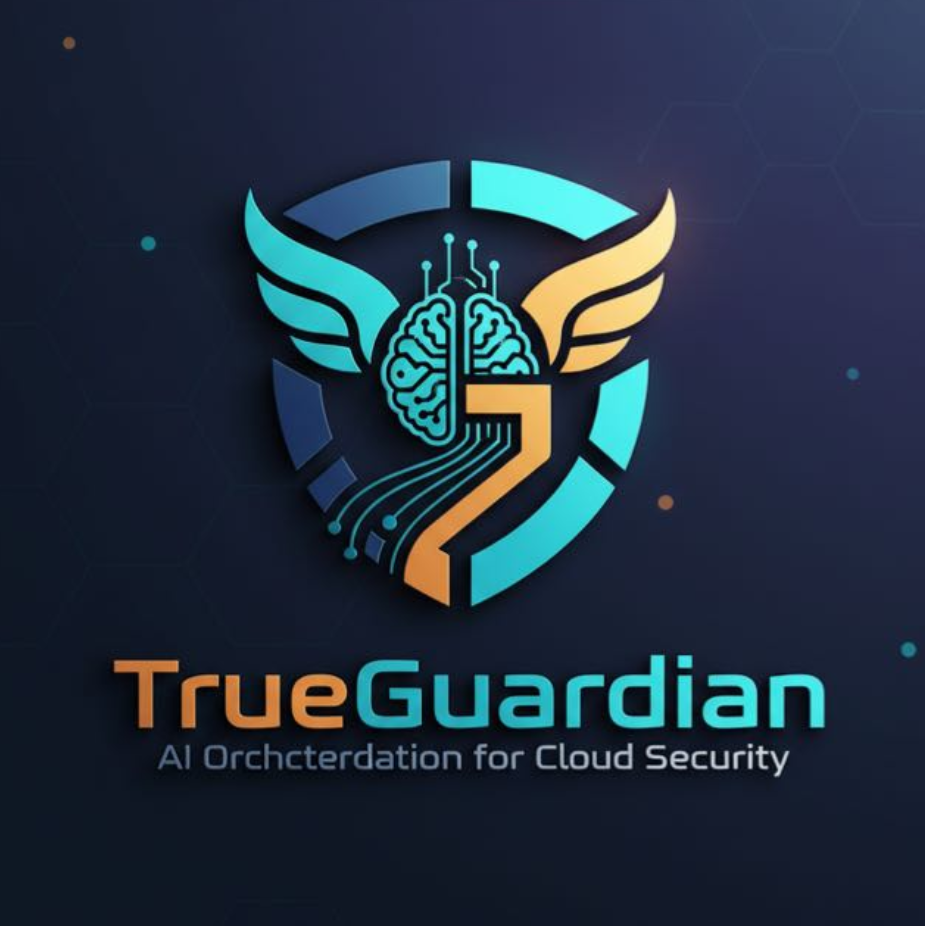

# TrueGuardian - AI-Powered Threat Detection



**AI Orchestration for Cloud Security**

TrueGuardian is an advanced browser extension that provides real-time threat detection and monitoring using AI-powered analysis. It combines cutting-edge security features with an intuitive dashboard to protect your digital life with every click.

---

## 🌟 Features

### 🛡️ Core Security Features
- **AI-Powered Threat Detection**: Detects SQLi, XSS, CSRF, RCE, data exfiltration, malware, and more
- **Real-Time Monitoring**: Continuous analysis of HTTP/HTTPS requests
- **AWS Bedrock Integration**: Claude 3.5 Sonnet for advanced threat analysis
- **Smart Notifications**: Browser alerts, badge updates, and on-page warning modals
- **Context Enrichment**: Captures tab info, session data, device details, and user identity

### 📊 Visualization & Analytics
- **Interactive Dashboard**: 4 Chart.js powered visualizations
  - Threats by Domain (Bar Chart)
  - Resource Types (Doughnut Chart)
  - Threats Over Time (Line Chart)
  - Severity Distribution (Bar Chart)
- **Advanced Grouping**: Group threats by domain, tab/session, resource type, or severity
- **Real-Time Statistics**: Live threat counts, confidence scores, and session tracking

### 📤 Export & Integration
- **CSV Export**: 16+ columns with full context data
- **JSON Export**: Nested structure with grouping and statistics
- **SIEM Integration**: Splunk HEC, Datadog Events API support
- **AWS SNS/EventBridge**: Cloud-based alerting and workflow automation
- **Webhook Support**: Custom integration endpoints

### 🎨 Modern UI/UX
- **Glassmorphism Design**: Beautiful dark theme with backdrop blur effects
- **Responsive Layout**: Works on desktop and mobile browsers
- **Interactive Elements**: Smooth transitions, hover effects, collapsible groups
- **Multi-Tab Dashboard**: Overview, Analysis, Threats, and Settings tabs

---

## 🚀 Quick Start

### Installation

1. **Download the Extension**
   ```bash
   git clone https://github.com/adi0900/TrueGaurdian.git
   cd TrueGaurdian/extension
   ```

2. **Load in Chrome**
   - Open `chrome://extensions/`
   - Enable "Developer mode"
   - Click "Load unpacked"
   - Select the `extension` folder

3. **Pin to Toolbar**
   - Click the puzzle icon in Chrome
   - Pin TrueGuardian to your toolbar

### Enable Advanced Features

For the full dashboard experience with charts and grouping:

```bash
cd extension

# Backup current files (optional)
mkdir backups
copy background.js backups\
copy popup.html backups\
copy popup.js backups\

# Activate advanced version
copy background-advanced.js background.js
copy popup-advanced.html popup.html
copy popup-advanced.js popup.js
```

Then reload the extension from `chrome://extensions/`

---

## 📖 Documentation

### Extension Documentation
- **[Quick Start Guide](extension/QUICK-START-ADVANCED.md)** - Get started in 5 minutes
- **[Advanced Features](extension/ADVANCED-FEATURES.md)** - Complete feature documentation
- **[Implementation Guide](extension/IMPLEMENTATION-GUIDE.md)** - Deployment and AWS setup
- **[Features Reference](extension/FEATURES-REFERENCE.md)** - Quick reference card

### Website Pages
- **[Overview](my-react-app/overview.html)** - Feature overview with statistics
- **[Threat Dashboard](my-react-app/threats.html)** - Live threat monitoring demo
- **[Documentation](my-react-app/documentation.html)** - Installation and API reference
- **[Installation Guide](my-react-app/installation-guide.html)** - Step-by-step setup
- **[Privacy Policy](my-react-app/privacy-policy.html)** - Privacy and data handling
- **[Terms of Service](my-react-app/terms-of-service.html)** - Legal terms
- **[Support](my-react-app/support.html)** - FAQ and troubleshooting

---

## 🏗️ Project Structure

```
TrueGaurdian/
├── extension/                      # Browser Extension
│   ├── background.js               # Service worker (basic)
│   ├── background-advanced.js      # Enhanced service worker with tagging
│   ├── background-enhanced.js      # Service worker with notifications
│   ├── popup.html                  # Extension popup (basic)
│   ├── popup-advanced.html         # Advanced dashboard with charts
│   ├── popup-enhanced.html         # Enhanced popup with filters
│   ├── popup.js                    # Popup logic (basic)
│   ├── popup-advanced.js           # Advanced dashboard logic
│   ├── popup-enhanced.js           # Enhanced popup logic
│   ├── content.js                  # Content script (basic)
│   ├── content-enhanced.js         # Content script with modals
│   ├── manifest.json               # Extension manifest V3
│   ├── manifest-enhanced.json      # Enhanced manifest with permissions
│   ├── aws-lambda-examples.js      # AWS integration examples
│   ├── export-examples/            # Sample export files
│   │   ├── threat-export-sample.csv
│   │   └── threat-export-sample.json
│   └── *.md                        # Documentation files
│
├── my-react-app/                   # React Website
│   ├── index.html                  # Homepage
│   ├── overview.html               # Feature overview
│   ├── threats.html                # Threat dashboard demo
│   ├── documentation.html          # Documentation page
│   ├── installation-guide.html     # Installation guide
│   ├── privacy-policy.html         # Privacy policy
│   ├── terms-of-service.html       # Terms of service
│   ├── support.html                # Support and FAQ
│   ├── favicon.png                 # TrueGuardian logo
│   └── src/                        # React source files
│
├── extension.zip                   # Packaged extension for download
└── README.md                       # This file
```

---

## 🔧 Configuration

### AWS Bedrock Setup (Optional)

To enable AI-powered threat analysis:

1. **Get AWS Credentials**
   - Create an AWS account
   - Enable Bedrock service in `us-east-1`
   - Request access to Claude 3.5 Sonnet model
   - Create IAM credentials with Bedrock access

2. **Configure Extension**
   Edit `background.js` or `background-advanced.js`:
   ```javascript
   const AWS_CONFIG = {
     region: 'us-east-1',
     accessKeyId: 'YOUR_ACCESS_KEY',
     secretAccessKey: 'YOUR_SECRET_KEY'
   };
   ```

3. **Reload Extension**
   - Go to `chrome://extensions/`
   - Find TrueGuardian
   - Click the reload icon

---

## 📊 Usage

### Basic Usage

1. **Open Dashboard**
   - Click the TrueGuardian icon in your toolbar
   - View real-time threat statistics

2. **Monitor Threats**
   - Browse the web normally
   - TrueGuardian analyzes all requests
   - Receive notifications for detected threats

3. **Export Data**
   - Click "Threats" tab
   - Apply filters (severity, type, search)
   - Click "Export CSV" or "Export JSON"

### Advanced Features

**Grouping Threats:**
- Group by Domain: See which sites have most threats
- Group by Tab: Track threats per browser tab
- Group by Type: Categorize by resource type
- Group by Severity: Prioritize critical threats

**Filtering:**
- Filter by severity (Critical, High, Medium, Low)
- Filter by resource type (API, JavaScript, Image, etc.)
- Search by domain or threat type

**Real-Time Charts:**
- Domain threat distribution
- Resource type breakdown
- Timeline of threats (last 24 hours)
- Severity distribution

---

## 🎯 Key Technologies

| Component | Technology | Version |
|-----------|-----------|---------|
| Extension | Chrome Manifest V3 | 3.0.0 |
| AI Model | AWS Bedrock Claude 3.5 Sonnet | Latest |
| Charts | Chart.js | 4.4.0 |
| Frontend | React | 18 |
| Styling | Tailwind CSS | Latest |
| Animations | GSAP | 3.12.5 |
| Storage | Chrome Storage API | - |
| Requests | Chrome WebRequest API | - |

---

## 🛠️ Development

### Prerequisites
- Node.js 16+ (for website development)
- Chrome/Chromium browser
- Git

### Local Development

**Extension Development:**
1. Make changes to extension files
2. Reload extension from `chrome://extensions/`
3. Test in browser

**Website Development:**
```bash
cd my-react-app
npm install
npm run dev
```

### Testing

**Manual Testing:**
1. Load extension in developer mode
2. Visit test websites with known vulnerabilities
3. Verify threat detection and alerts
4. Check export functionality

**Export Testing:**
- Test CSV export with filters
- Test JSON export with grouping
- Verify all context fields are present

---

## 📦 Deployment

### Extension Deployment

**Chrome Web Store:**
1. Zip the `extension` folder
2. Go to [Chrome Developer Dashboard](https://chrome.google.com/webstore/devconsole)
3. Upload the zip file
4. Fill in store listing details
5. Submit for review

**Self-Hosted:**
1. Package: `extension.zip` (already created)
2. Share the zip file
3. Users load as unpacked extension

### Website Deployment

**GitHub Pages:**
```bash
# Push to gh-pages branch
git subtree push --prefix my-react-app origin gh-pages
```

**Netlify/Vercel:**
1. Connect GitHub repository
2. Set build directory: `my-react-app`
3. Deploy

---

## 🤝 Contributing

Contributions are welcome! Please follow these steps:

1. Fork the repository
2. Create a feature branch (`git checkout -b feature/amazing-feature`)
3. Commit your changes (`git commit -m 'Add amazing feature'`)
4. Push to the branch (`git push origin feature/amazing-feature`)
5. Open a Pull Request

### Development Guidelines
- Follow existing code style
- Test thoroughly before submitting
- Update documentation for new features
- Do not commit sensitive credentials

---

## 👥 Team

- **Aditya** - Team Lead Developer
- **Nilam** - Backend Engineer
- **Indhu** - Plugin Specialist
- **Eric Zhang** - Cloud Specialist

---

## 📄 License

This project is licensed under the MIT License - see the [LICENSE](extension/LICENSE) file for details.

---

## 🔗 Links

- **GitHub Repository**: [https://github.com/adi0900/TrueGaurdian](https://github.com/adi0900/TrueGaurdian)
- **Website**: [TrueGuardian Homepage](my-react-app/index.html)
- **Documentation**: [Full Documentation](extension/ADVANCED-FEATURES.md)
- **Support**: [FAQ & Troubleshooting](my-react-app/support.html)

---

## 📞 Contact & Support

- **X (Twitter)**: [@Motion_Viz](https://x.com/Motion_Viz)
- **Instagram**: [@aditya_09_28](https://www.instagram.com/aditya_09_28/)
- **GitHub Issues**: [Report a Bug](https://github.com/adi0900/TrueGaurdian/issues)
- **Email**: [Support Page](my-react-app/support.html)

---

## 🙏 Acknowledgments

- **AWS Bedrock** - AI-powered threat analysis
- **Chart.js** - Interactive visualizations
- **Unsplash** - Background images
- **Chrome Extension APIs** - Request monitoring capabilities
- **React & Tailwind CSS** - Website framework

---

## ⚠️ Disclaimer

TrueGuardian is provided "as is" without warranty of any kind. While we strive for accurate threat detection, no security tool is 100% effective. Use in combination with other security measures for best protection.

**Important:**
- Review Privacy Policy before use
- Secure your AWS credentials
- Do not use for malicious purposes
- Comply with all applicable laws

---

## 📈 Roadmap

### Upcoming Features
- [ ] Machine learning model training from threat data
- [ ] Browser sync for cross-device protection
- [ ] Mobile app for threat monitoring
- [ ] Advanced reporting with PDF export
- [ ] Integration with more SIEM platforms
- [ ] Custom threat rules engine
- [ ] Multi-language support

### In Progress
- [x] Advanced threat monitoring with network tagging
- [x] Interactive dashboard with Chart.js
- [x] CSV/JSON export with full context
- [x] AWS Bedrock integration
- [x] Real-time notifications

---

## 🌟 Star History

If you find TrueGuardian useful, please ⭐ star this repository!

---

**Made with ❤️ by the TrueGuardian Team**

*Protecting your digital life, one threat at a time.*
